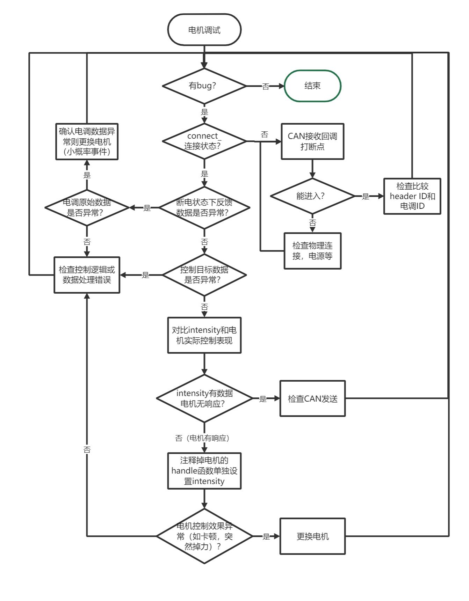

# motor电机程序说明文档

电机类相比旧版框架有较大改动，主要为将电机进行抽象，与具体功能、上层控制逻辑分离，不同功能逻辑的电机不在motor类中进行区分。

一般在application的程序中设置电机控制输入（角度、角速度等），在driver程序中根据电机控制输出（intensity）对实际电机进行控制。关于如何在代码中加入一个新的电机并控制参考motor_monitor说明部分。

电机类中的角度单位均使用角度制（$\degree$），角速度单位均使用度/秒（$\degree/s$）。

## motor_monitor说明

motor_monitor文件用于定义和声明电机变量，配置电机参数和ID。另外motor_monitor定义了统一管理所有电机模式和处理所有已挂载电机的函数（allMotors…）。后续添加其他非大疆型号的电机，也应按类似方式对电机进行定义、声明、参数配置和管理。

### 如何在代码中加入一个新的电机并进行控制

以步兵拨盘电机为例（M2006，位置速度双环控制，接在CAN1总线上，电调ID=5）

#### 1. 在motor_monitor.cpp中定义电机

```c++
// Stir motor
Motor STIR(motor::M2006, 36, motor::POSITION_SPEED,  // type, ratio, method
           PID(20, 0.1, 10, 10, 2500),               // ppid
           PID(60, 0.1, 200, 1000, 10000));          // spid
```

设置电机型号、减速比、控制方法、双环PID参数

#### 2. 在对应CAN通道电机指针数组对应ID处添加该电机的指针

```c++
Motor* can1_dji_motor[11] = {
    nullptr,  // id:1
    nullptr,  // id:2
    nullptr,  // id:3
    nullptr,  // id:4
    &STIR,    // id:5
    nullptr,  // id:6
    nullptr,  // id:7
    nullptr,  // id:8
    nullptr,  // id:9
    nullptr,  // id:10
    nullptr   // id:11
};
```

#### 3. 在motor_monitor.h中添加全局变量声明

```c++
extern Motor STIR;
```

#### 4. 在control.cpp中对STIR电机进行控制

```c++
if (……) {
  STIR.targetAngle() += 45;
}
```

## motor类成员变量说明

### 1. info_

储存电机基本信息

```C++
motor::Type_e type
电机型号，与max_intensity关联

uint8_t can_channel
使用的CAN通道（0: 未挂载, 1: CAN1, 2: CAN2），由driver和挂载数组自动生成

uint8_t id
电机ID，由driver和挂载数组自动生成

float max_intensity
控制信号范围[-max_intensity, max_intensity]，在构造函数中根据电机型号设置
```

### 2. connect_

检测该电机连接状态

### 3. mode_

电机工作模式：断电/停止/初始化/正常工作。

```c++
POWEROFF -- 断电模式
输出电流 = 0

STOP -- 停止模式
电机转速 = 0。停止模式依赖速度环PID，在不使用速度环PID的状态下停止模式和断电模式表现相同

INIT -- 初始化
变量初始化处理，输出电流 = 0

WORKING -- 正常工作
正常输出电流
```

### 4. method_

控制方法：位置+速度控制/位置控制/速度控制/力矩控制

### 5. ratio_

减速比，可以为负数

### 6. intensity_

输出控制信号

### 7. control_data_

电机控制相关数据，包括

- 目标角度target_angle（即旧版框架中targetAngle）
- 目标速度target_speed（即旧版框架中targetSpeed）
- 目标力矩target_torque
- 反馈角度fdb_angle（即旧版框架中realAngle）
- 反馈速度fdb_speed（即旧版框架中realSpeed）

其中反馈角度和反馈速度数据源默认为电机自身角度或速度，可以通过setFeedbackSource函数改变反馈数据源，例如将云台电机的反馈数据修改为imu的姿态角和角速度。

### 8. motor_data_

电机自身数据，包括
- 累计角度angle,
- 编码器角度ecd_angle,
- 转速rotate_speed,
- 转矩电流current,
- 温度temp

相比旧版框架将电机自身数据和控制反馈数据分离，即使不使用电机自身数据作为反馈时也保持更新。

### 9. 控制算法相关

```c++
位置环PID
PID ppid_

速度环PID
PID spid_

卡尔曼滤波类实例
KalmanFilter kf_

储存卡尔曼滤波状态、输入、输出向量
KalmanFilterData_t kf_data_
```

### 10. 电机输出模型

todo，用于力矩控制

## motor类成员函数

```c++
// 设置目标角度，角速度/输出前馈
void setAngleSpeed(float target_angle, float ff_speed = 0, float ff_intensity = 0);

// 设置目标角度，输出前馈
void setAngle(float target_angle, float ff_intensity = 0);

// 设置目标角速度，输出前馈
void setSpeed(float target_speed, float ff_intensity = 0);

// 设置控制反馈数据源 (数据源变量单位必须为: deg, dps)
输入空指针: 使用motor_data_作为反馈数据源
void setFdbSrc(float* fdb_angle_src, float* fdb_speed_src);

// 将控制反馈角度control_data_.angle重置为特定角度
void resetFeedbackAngle(float angle);

// 旧框架代码风格函数
float& targetAngle(void) { return control_data_.target_angle; }
float& targetSpeed(void) { return control_data_.target_speed; }
float& realAngle(void) { return control_data_.fdb_angle; }
float& realSpeed(void) { return control_data_.fdb_speed; }

// 卡尔曼滤波状态量
float& kfAngle(void) { return kf_data_.x[0]; }
float& kfSpeed(void) { return kf_data_.x[1]; }
```

## 电机驱动

### DJI电机驱动

大疆电机（M3508/M2006/GM6020）驱动程序

ID配置：采用Motor指针数组挂载的方式配置电机ID，具体参考motor_monitor。挂载后的Motor对象对应ID接收到反馈数据后，会在canRxMsgCallback

CAN通信发送：在can_monitor中统一管理调用 **dji_motor_driver.canTxMsg()** 函数

调试：**dji_motor_driver.can1_raw_data** 和 **dji_motor_driver.can2_raw_data** 储存了电调反馈的原始数据

相关资料：[M3508电机&C620电调](https://www.robomaster.com/zh-CN/products/components/general/M3508)，[M2006电机&C610电调](https://www.robomaster.com/zh-CN/products/components/general/M2006)，[GM6020电机](https://www.robomaster.com/zh-CN/products/components/general/GM6020)

## 电机程序运行流程

### 1. 初始化-电机ID配置

根据电机变量指针位置设置电机类内info_.id信息。

### 2. 设置电机目标参数（角度、角速度等）

robot.cpp-controlTask()中执行，周期1ms。

### 3. 电机数据处理（计算反馈，运行控制算法，计算输出）

robot.cpp-motorTask()中执行，周期1ms。

### 4. canTask-CAN通信电机控制数据包发送

can_monitor.cpp-canTxMonitor()中执行（在robot.cpp-canTask中调用），发送控制信号，周期在can_monitor中的与其他CAN通信发送统一管理。

### 5. canRxMsgCallback-CAN接收回调

callback.cpp-HAL_CAN_RxFifo0MsgPendingCallback()中响应CAN接收中断执行，正常情况下周期为1ms，更新电调反馈信息。

## 电机问题排查参考流程


该流程仅供参考，熟悉电机程序运行逻辑后可根据经验灵活调整提高debug效率。
